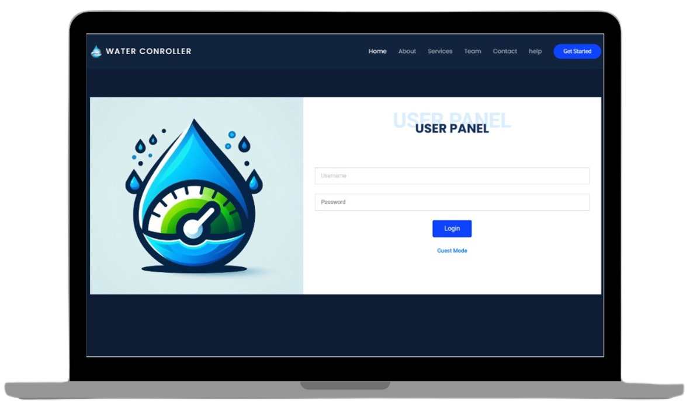
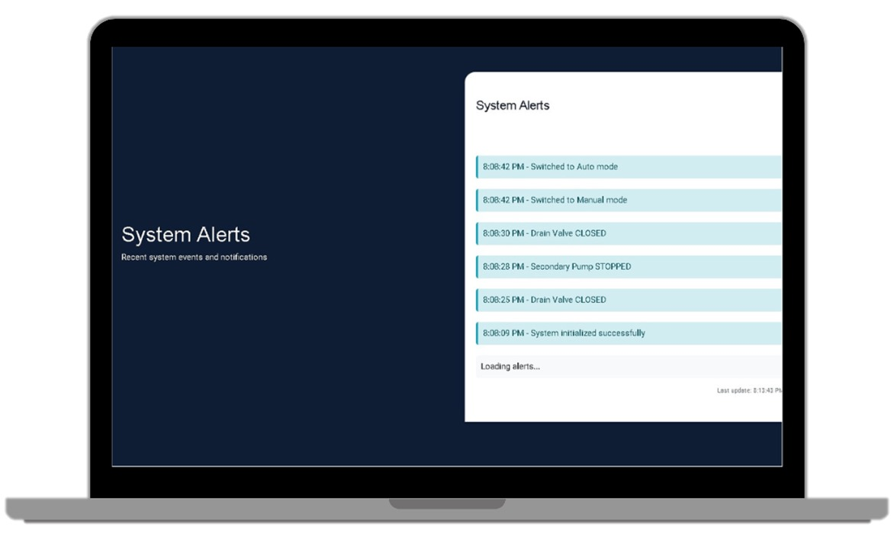
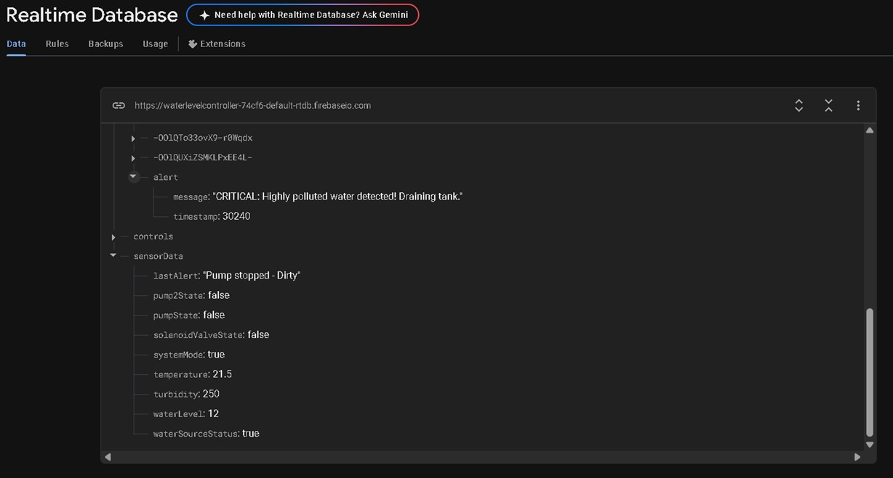
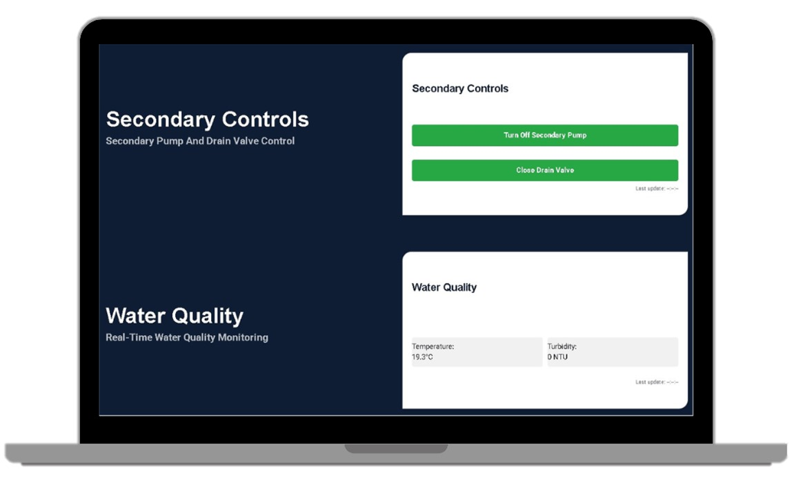
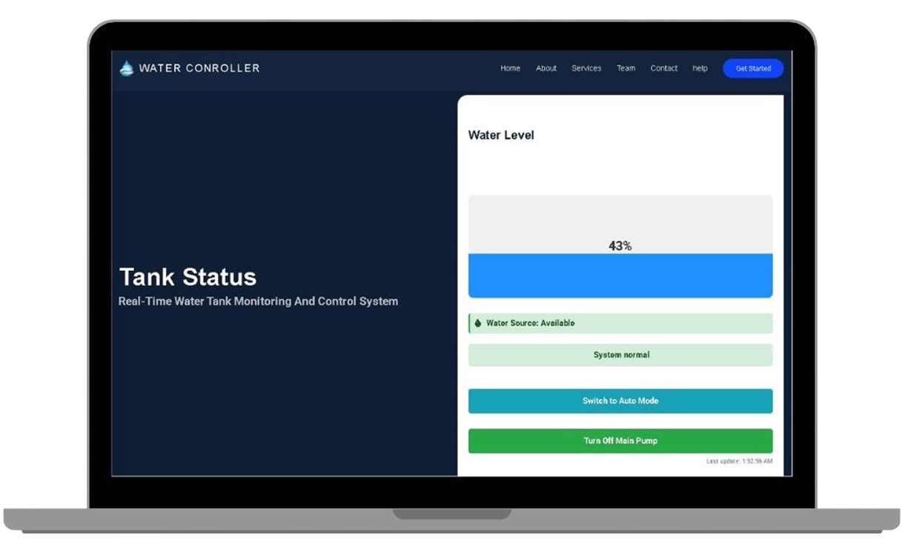

## IoT Water Level Controller

## Description
A smart IoT-based system for real-time monitoring and control of water levels in tanks or stations. The project features live sensor integration, automated email alerts for emergencies, user authentication, and a modern dashboard for visualization and device management.

## Technologies
<div>


</div>

## Key Features
- **Real-Time Water Level Monitoring:** Instantly track water levels and sensor data.
- **Automated Alerts:** Receive email notifications for emergencies (e.g., low water, sensor failure, password changes).
- **User Authentication:** Secure login, password reset, and user management.
- **Device Control:** Remotely control pumps and valves from the dashboard.
- **Historical Data:** View and analyze water level trends over time.
- **Responsive Dashboard:** Modern web interface for visualization and control.
- **Cloud Integration:** Uses Firebase and MongoDB for robust data storage and real-time updates.

## Installation
1. **Clone the Repository:**
   ```bash
   git clone https://github.com/Halimmsbah/IOT_WaterLevelController.git
   cd IOT_WaterLevelController
   ```
2. **Install Dependencies:**
   ```bash
   npm install
   ```
3. **Set Up Environment Variables:**
   - Create a `.env` file in the root directory.
   - Add your configuration (MongoDB URI, Firebase credentials, email settings, etc.):
     ```properties
     PORT=your_port
     MONGODB_URI=your_mongodb_uri
     FIREBASE_CONFIG=your_firebase_config
     EMAIL_NAME=your_email
     EMAIL_PASS=your_email_password
     ADMIN_EMAIL=admin_email_for_alerts
     JWT_KEY=your_jwt_secret
     ```
4. **Run the App:**
   ```bash
   npm start
   ```

## Project Structure
```plaintext
IOT_WaterLevelController/
├─ assets/
│  ├─ css/
│  ├─ js/
│  └─ img/
├─ database/
│  └─ models/
├─ screenshots/
│  ├─ 38e20c3f0c3a4492a7c2b4c3695f00fc.jpg
│  ├─ 6399027f308d4ff3901e55a1594f3ba3.jpg
│  ├─ 93e924fe928f47a388069a17bc5051e9.jpg
│  ├─ c4a787d7f552497f80ce4da87e257ed7.jpg
│  └─ f914b3a43b4c4240b1e596b46c0e0288.jpg
├─ src/
│  ├─ middleware/
│  ├─ modules/
│  │  ├─ auth/
│  │  ├─ sensors/
│  │  └─ user/
│  ├─ services/
│  │  └─ email/
│  └─ utils/
├─ .gitignore
├─ home.html
├─ index.js
├─ package.json
└─ README.md
```

## Screenshots

<p align="center">
  
  
  
  
  
</p>

## Credits
Developed by Abdelhalim Sbah as a graduation project.

## License
This project is licensed under the MIT License.
